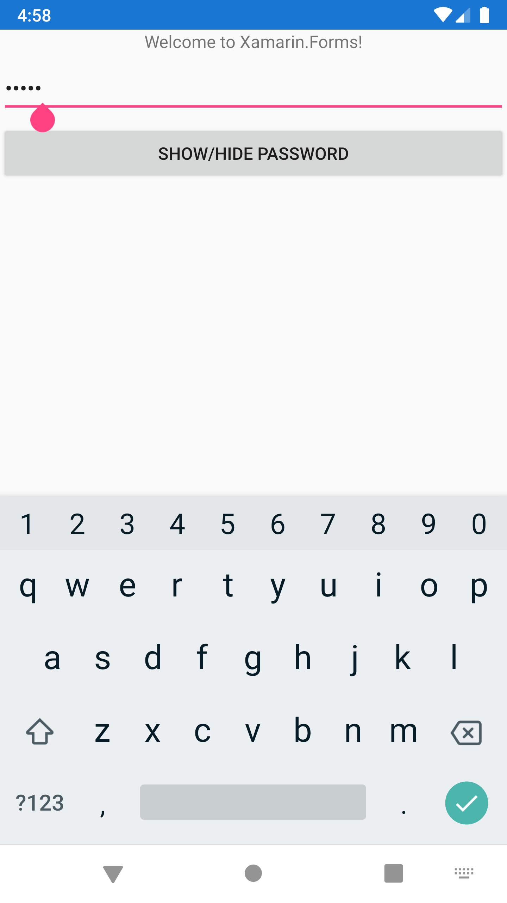
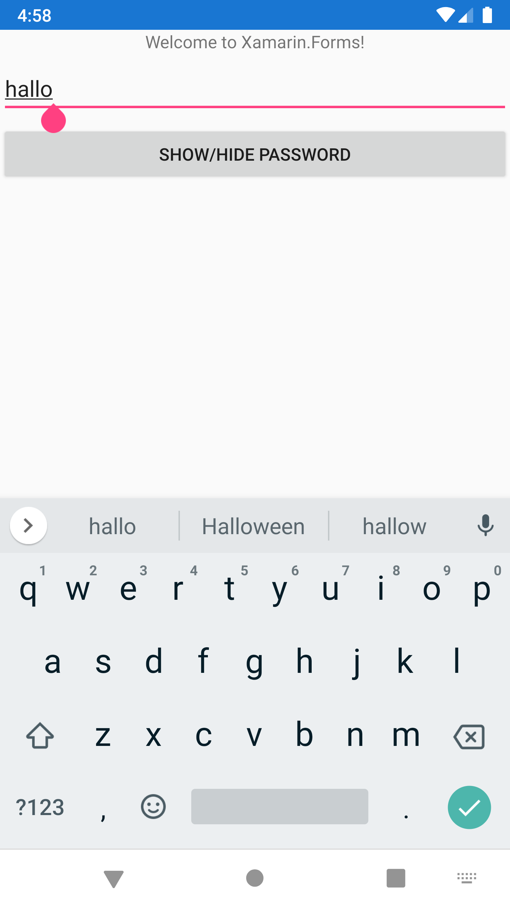

# Password entry in Xamarin.Forms

A code sample for the Xamarin.Forms [issue 10857](https://github.com/xamarin/Xamarin.Forms/issues/10857).

## The issue

In a Xamarin.Forms app, we have an `Entry` and a button to show/hide password. It works perfectly fine on iOS but on Android, once the password is shown, the keyboard shows also text predictions, even though the predictions and spellcheck are disabled:

```xaml
<Entry
    x:Name="TxtPassword"
    IsPassword="False"
    IsSpellCheckEnabled="False"
    IsTextPredictionEnabled="False" />
<Button
    Clicked="Button_Clicked"
    Text="Show/Hide Password" />
```

```csharp
private void Button_Clicked(System.Object sender, System.EventArgs e)
{
    TxtPassword.IsPassword = !TxtPassword.IsPassword;
}
```




